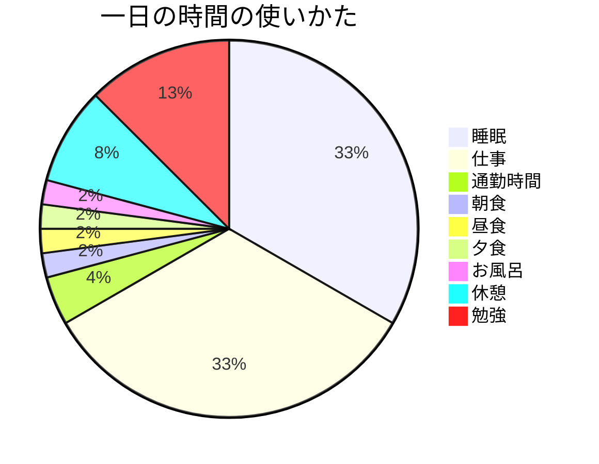
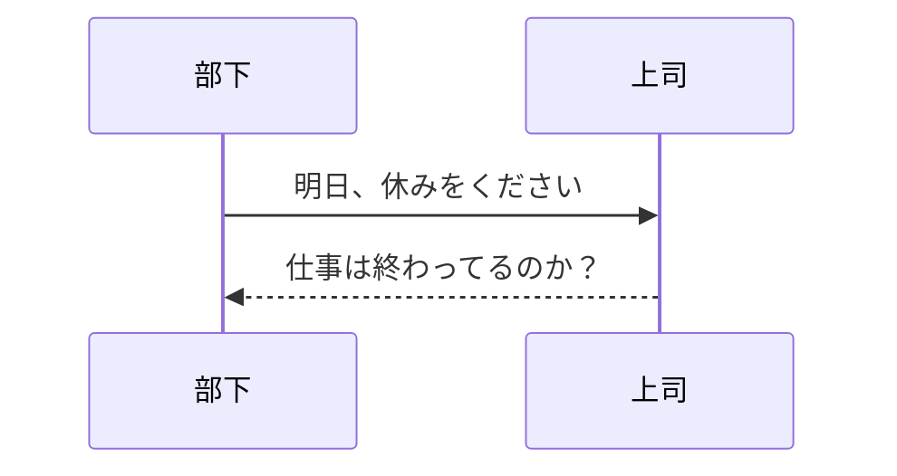
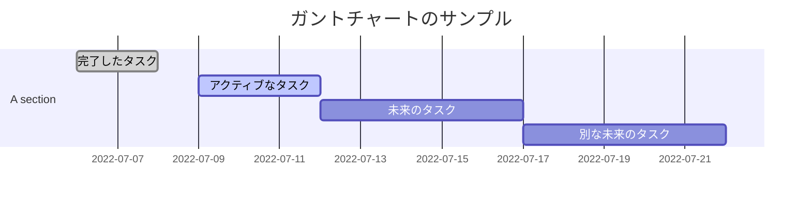
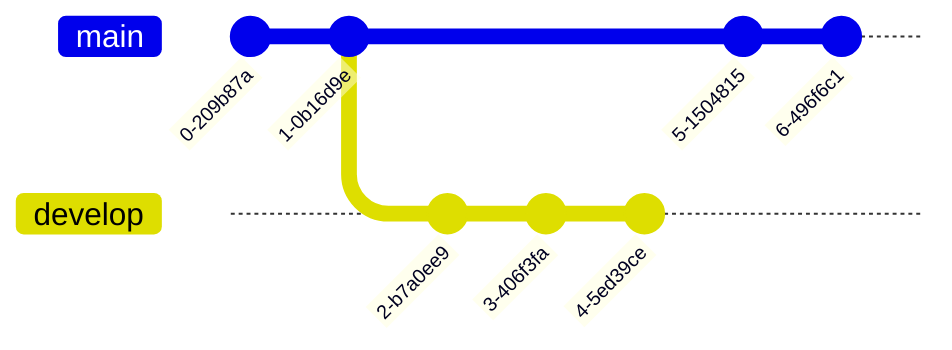

# mermaidで記述できるダイアグラムの記述例とコード 
1. 円グラフ
~~~

~~~

2. シーケンス図のサンプル
~~~

~~~

引用元のサイトはこちら
>https://usefuledge.com/vscodemermaidsupport.html#toc6

3. フローチャート
~~~

~~~

4. ガントチャート
~~~

~~~

5. Gitグラフ
~~~

~~~

引用元のサイトはこちら
>https://notepm.jp/help/mermaid
